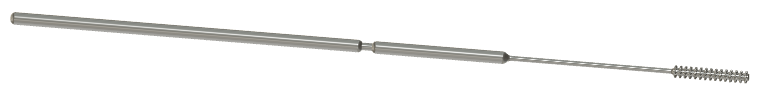
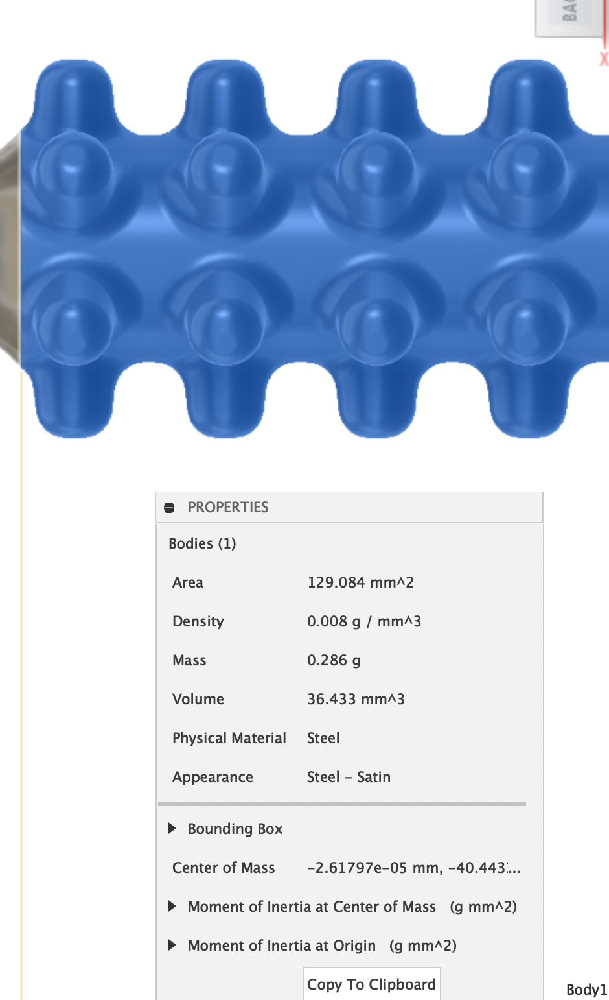
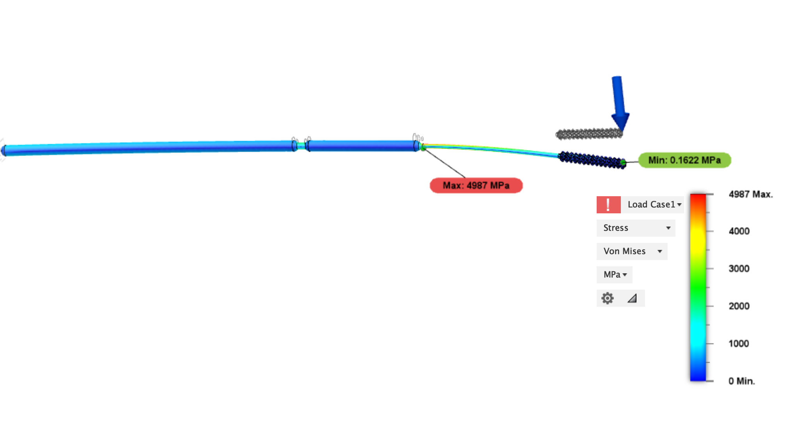

These swabs were modeled in Autodesk Fusion 360
- available here: https://a360.co/2Qyh2GE

# Nubs Surface Area

# Nubs Break Point
- shaft snapped off at head of bristle
- TODO: weaken break-point area and strengthen briste-shaft interface 

