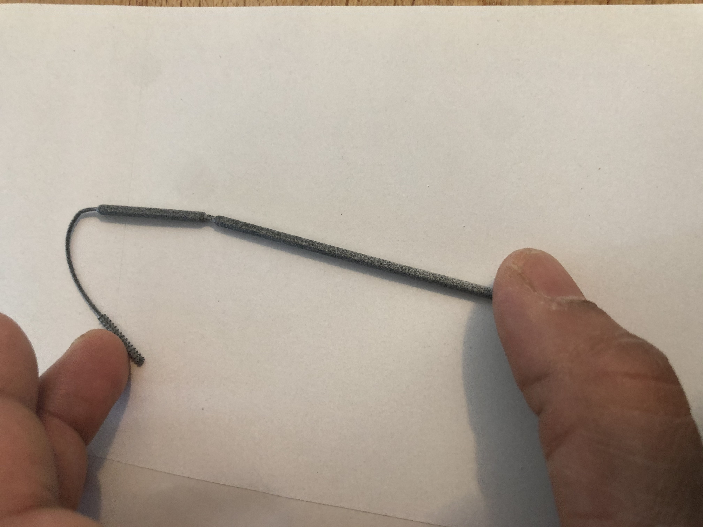
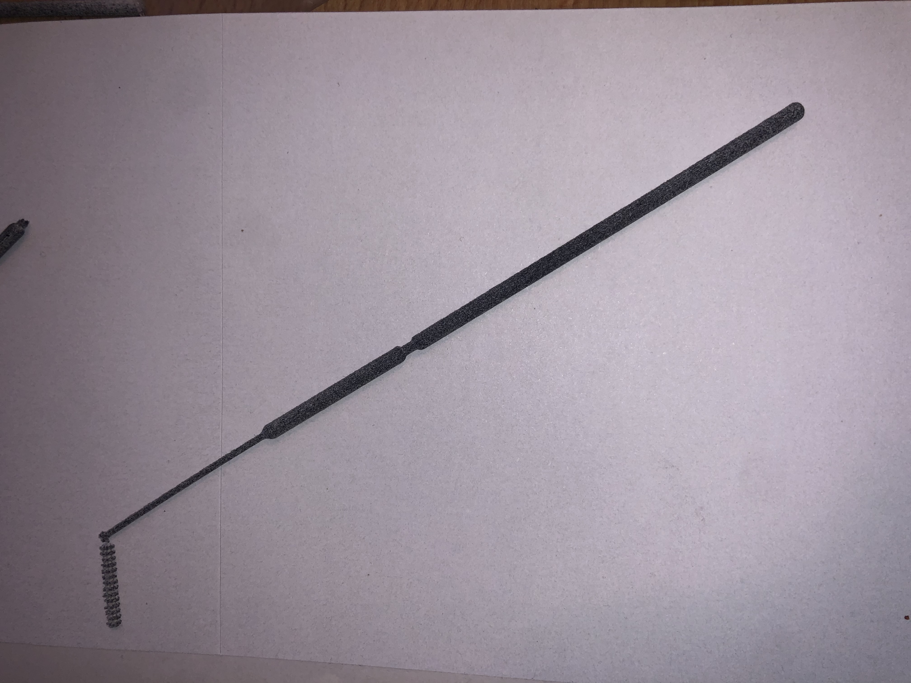
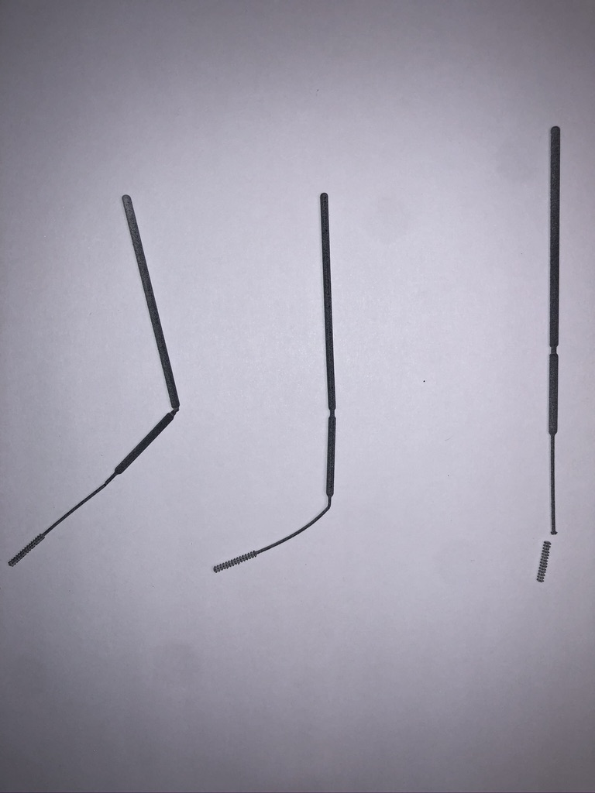

These swabs were printed using HP MJF 3D printing technology at Fathom Studios in Oakland Ca.
They are of the initial model (nubs).

# Flexibility
- swabs are quite flexible
- can bend more than 180 degrees without breaking

# Torsional Load (twisting)
- shaft snapped off at head of bristle
- TODO: define spec for torsional load, add tests in simulation

# Static Load at Tip (bending to break)
- bends first and bristle to swab shaft interface
- TODO: make break-off-point weaker (test V's, grooves, stress points - in simulation)

